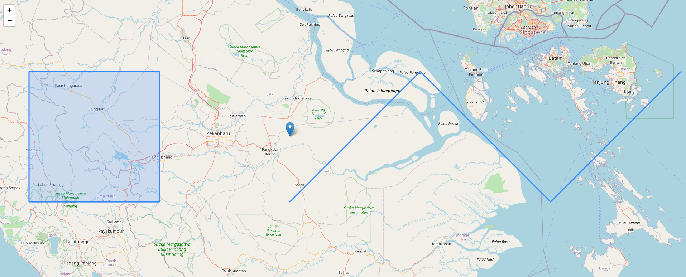

# Python Projects
A collection of example Python projects.

## app
Flask server and utility code for API and UI components.

### app.py
Flask server code. Includes both API and UI endpoints.

#### Endpoints
1. `/api/`
   1. __GET__: Returns list of all UUIDs
   1. __POST__: Upload GeoJSON file and bind new UUID
1. `/api/{UUID}`
   1. __GET__: Returns GeoJSON for mapped UUID
   1. __POST__: Add/Update GeoJSON file for UUID
   1. __DELETE__: Removes GeoJSON UUID
1. `/ui/{UUID}`
   1. Renders Folium/Leaflet map containing UUID GeoJSON features

### geo.py
Utility class for managing GeoJSON data mapping and filesystem persistence.

## scripts

### client.py
Requests CLI client used to interact with API endpoints.

## Requirements
* `Pipfile` requires Python 3.10

## Demo
1. From terminal 1, launch Flask app server via `pipenv shell` and observe client requests.
   ```
   flask --app app/app run
   INFO:app.app:<app.geo.GeoJsonStorageManager object at 0x71f031e25780> scanning tmp/storage for UUID GeoJSON files.
    * Serving Flask app 'app/app'
    * Debug mode: off
   INFO:werkzeug:WARNING: This is a development server. Do not use it in a production deployment. Use a production WSGI server instead.
    * Running on http://127.0.0.1:5000
   INFO:werkzeug:Press CTRL+C to quit
   INFO:app.app:wrote: tmp/storage/840735ec-aa0f-4b86-b516-771792b955dd
   INFO:werkzeug:127.0.0.1 - - [03/May/2024 14:53:10] "POST /api/ HTTP/1.1" 200 -
   INFO:werkzeug:127.0.0.1 - - [03/May/2024 14:53:54] "GET /ui/840735ec-aa0f-4b86-b516-771792b955dd HTTP/1.1" 200 -
   ```
2. From terminal 2, use the cli client script via `pipenv shell` to upload a GeoJSON file.
   ```
   python scripts/client.py add --file data/example-1-geo.json 
   INFO:__main__:request url: http://127.0.0.1:5000/api/
   INFO:__main__:request header: {'User-Agent': 'python-requests/2.31.0', 'Accept-Encoding': 'gzip, deflate', 'Accept': '*/*', 'Connection': 'keep-alive', 'Content-Length': '1074', 'Content-Type': 'multipart/form-data; boundary=e2345c9a1dc231c6b01e3035da8dbea9'}
   INFO:__main__:request method: POST
   INFO:__main__:response status: 200
   INFO:__main__:response content: b'840735ec-aa0f-4b86-b516-771792b955dd'
   ```
3. From web browser client, view the uploaded GeoJSON resource by navigating to `http://127.0.0.1:5000/ui/<UUID>`
   

## TODO
 * unit testing
 * database integration
 * add UI API documentation and endpoint testing (OpenAPI/Swagger)
 * add UI endpoints for GeoJSON management via API